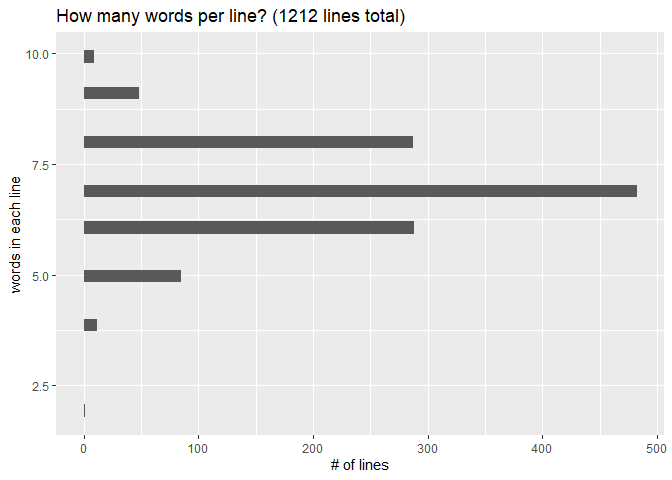
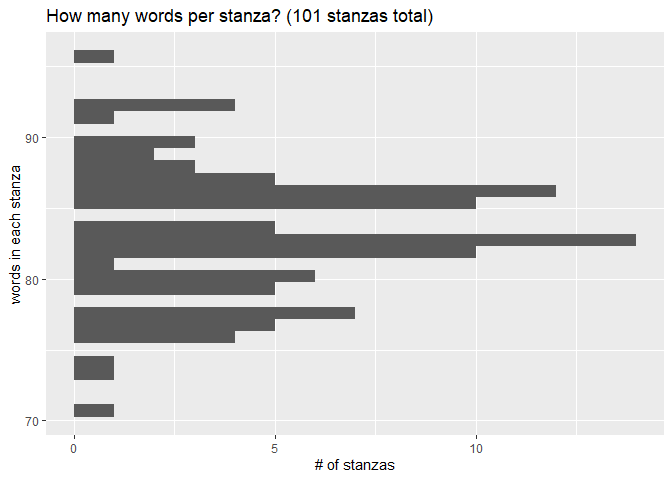
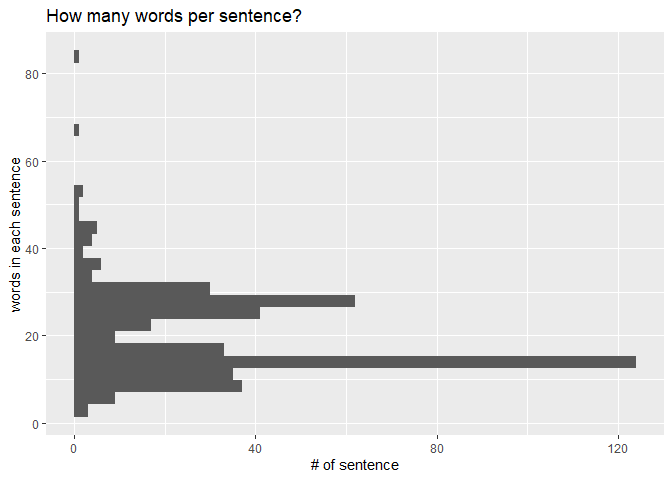

Pearl tibble EDA May 2022
================
Shirley Li
2022-5-20

## Project summary


Some of the most celebrated and intricate late medieval poems are
written by an anonymous fourteenth century West Midlands poet known as
the Pearl-poet or Gawain-poet. Scholars agree that four poems from the
Cotton Nero a.x. manuscript were written by the Pearl-poet: Pearl, Sir
Gawain and the Green Knight, Cleanness, and Patience.

A few scholars, however, have argued for a fifth poem in the
Pearl-poet’s ouevre: St. Erkenwald, also a fourteenth century
alliterative poem that survives in a different British Library MS Harley
2250.

My project will train an authorship attribution model on three poems:
Pearl, Sir Gawain and the Green Knight, and Cleanness. I’ll then test
this model on the fourth positively attributed poem, Patience, as well
as the disputed poem St. Erkenwald.

As an added benefit, I’ll (hopefully) get to think deeply about literary
and structural patterns in the poems such as word choice, rhyme,
sentence/stanza length, and more.

## Some code

``` r
#### Here's the first fifty lines sorted by line number, stanza number, and section number!
pearl_df
```

    ## # A tibble: 1,213 × 4
    ##    text                                     section stanza line_number
    ##    <chr>                                      <dbl>  <dbl>       <int>
    ##  1 Perle, plesaunte to prynces paye               1      1           1
    ##  2 To clanly clos in golde so clere,              1      1           2
    ##  3 Oute of Oryent, I hardyly saye,                1      1           3
    ##  4 Ne proved I never her precios pere.            1      1           4
    ##  5 So rounde, so reken in uche araye,             1      1           5
    ##  6 So smal, so smothe her sydes were,             1      1           6
    ##  7 Queresoever I jugged gemmes gaye               1      1           7
    ##  8 I sette hyr sengeley in synglure.              1      1           8
    ##  9 Allas, I leste hyr in on erbere;               1      1           9
    ## 10 Thurgh gresse to grounde hit fro me yot.       1      1          10
    ## # ℹ 1,203 more rows

## Some fun graphs about Pearl

``` r
tidy_pearl %>% 
  group_by(line_number) %>% 
  summarize(line_count = n()) %>% 
  ggplot() +
  geom_histogram(aes(line_count)) +
  coord_flip() +
  labs(x='words in each line',
         y='# of lines',
         title='How many words per line? (1212 lines total)')
```

<!-- -->

``` r
tidy_pearl %>% 
  group_by(stanza) %>% 
  summarize(stanza_count = n()) %>% 
  ggplot() +
  geom_histogram(aes(stanza_count)) +
  coord_flip() +
  labs(x='words in each stanza',
         y='# of stanzas',
         title='How many words per stanza? (101 stanzas total)')
```

<!-- -->

``` r
pearl_flat <- str_flatten(original_text, collapse = " ")

pearl_sentence <- 
  str_split(pearl_flat, boundary("sentence")) %>% 
  purrr::flatten_chr() %>% 
  as_tibble()

pearl_sentence <-
  pearl_sentence %>% 
  mutate(sentence_length = str_count(value, boundary("word")))

ggplot(pearl_sentence)+
  geom_histogram(aes(sentence_length)) +
  coord_flip() +
  labs(x='words in each sentence',
         y='# of sentence',
         title='How many words per sentence?')
```

<!-- -->
